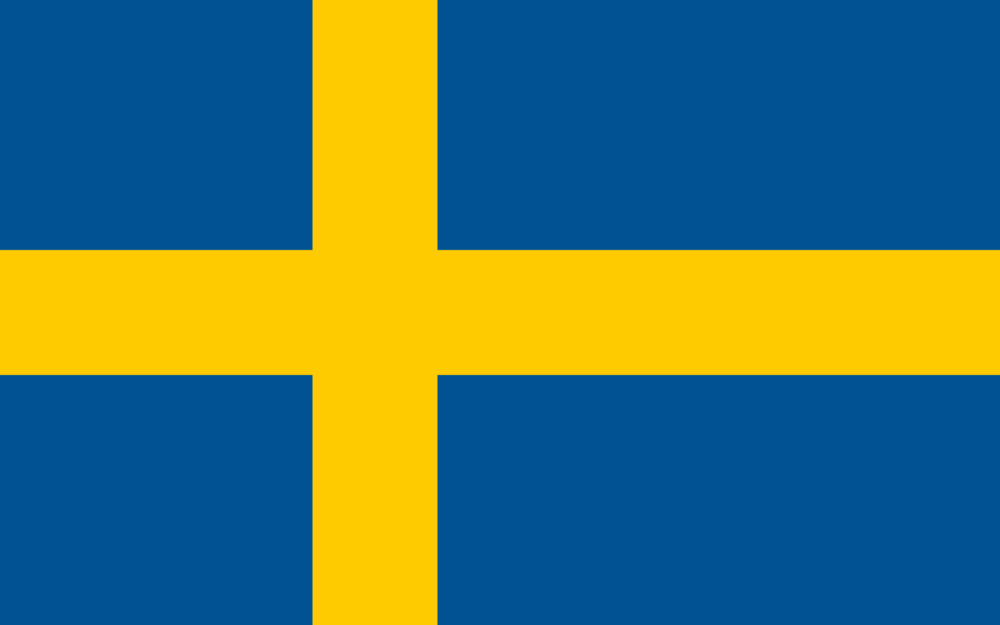
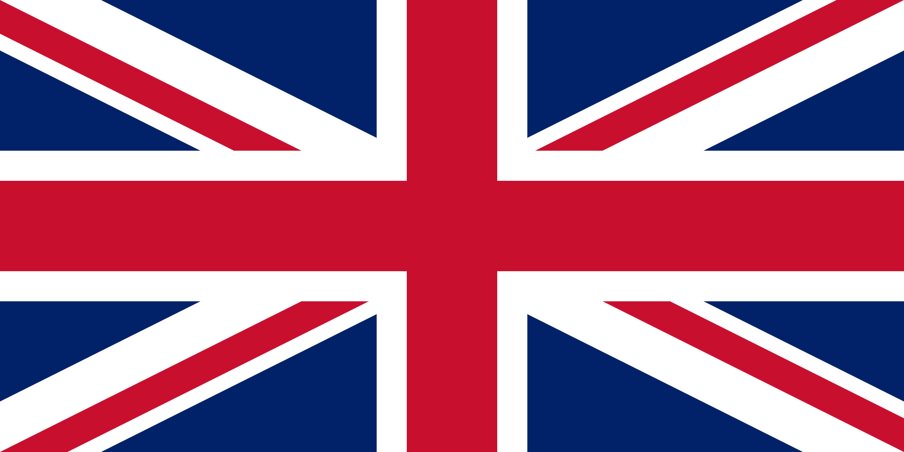
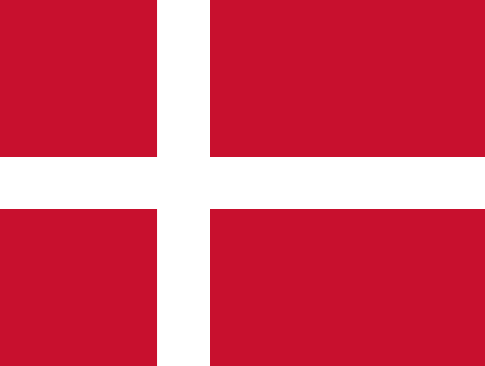

# Language Selector with Flag Icons - Quick Guide

## Flag Image Files Available

Your game folder already contains flag images for all 4 languages:

```
se.png  ← Swedish (Sverige)
en.png  ← English
dk.png  ← Danish (Danmark)
no.png  ← Norwegian (Norge)
```

Use these filenames when creating language selector buttons.

---

## Quick Implementation

### Simplest Option: HTML Button Grid

Add this to your `index.html` in the start screen:

```html
<div style="display: grid; grid-template-columns: repeat(4, 1fr); gap: 15px; margin: 20px 0;">
    <button onclick="setLanguage('sv')" style="padding: 15px; background: #1a0033; border: 2px solid #8200ff; cursor: pointer;">
        <br>
        <span style="color: #ffcc00; font-size: 12px;">Svenska</span>
    </button>
    <button onclick="setLanguage('en')" style="padding: 15px; background: #1a0033; border: 2px solid #8200ff; cursor: pointer;">
        <br>
        <span style="color: #ffcc00; font-size: 12px;">English</span>
    </button>
    <button onclick="setLanguage('da')" style="padding: 15px; background: #1a0033; border: 2px solid #8200ff; cursor: pointer;">
        <br>
        <span style="color: #ffcc00; font-size: 12px;">Dansk</span>
    </button>
    <button onclick="setLanguage('no')" style="padding: 15px; background: #1a0033; border: 2px solid #8200ff; cursor: pointer;">
        <br>
        <span style="color: #ffcc00; font-size: 12px;">Norsk</span>
    </button>
</div>
```

---

## Language Code to Flag File Mapping

| Language | Code | Flag File |
|----------|------|-----------|
| Swedish | sv | se.png |
| English | en | en.png |
| Danish | da | dk.png |
| Norwegian | no | no.png |

---

## Three Placement Options

### Option 1: Start Screen (Full Grid)
**Best for:** Player to select language when starting game

```html
<div style="display: grid; grid-template-columns: repeat(4, 1fr); gap: 15px;">
    <!-- Flag buttons here -->
</div>
```

**Features:**
- Large, easy to click
- Shows all options clearly
- Good for mobile

---

### Option 2: Top-Right Corner (Compact)
**Best for:** Always visible during gameplay

```html
<div style="position: fixed; top: 20px; right: 20px; display: flex; gap: 8px; z-index: 50;">
    <button onclick="setLanguage('sv')" style="width: 40px; height: 40px; padding: 3px; border: 2px solid #8200ff; cursor: pointer;">
        
    </button>
    <!-- More buttons -->
</div>
```

**Features:**
- Doesn't interfere with game
- Always accessible
- Compact size

---

### Option 3: Bottom-Right Floating Menu
**Best for:** Easy access without covering UI

```html
<div style="position: fixed; bottom: 20px; right: 20px; display: flex; flex-direction: column; gap: 8px; z-index: 50;">
    <!-- Flag buttons in column -->
</div>
```

---

## Complete Working Example

### HTML (index.html)
```html
<!DOCTYPE html>
<html>
<head>
    <script src="translations.js"></script>
    <style>
        .lang-btn {
            padding: 10px;
            background: #1a0033;
            border: 2px solid #8200ff;
            cursor: pointer;
            border-radius: 5px;
            transition: all 0.3s;
        }
        .lang-btn:hover {
            border-color: #00ffcc;
            transform: scale(1.05);
        }
        .lang-btn img {
            width: 50px;
            height: auto;
            border-radius: 3px;
        }
    </style>
</head>
<body>
    <div id="start-screen">
        <h1>BASE DEFENSE ULTRA</h1>
        
        <!-- Language Selector -->
        <div style="display: grid; grid-template-columns: repeat(4, 1fr); gap: 15px;">
            <button class="lang-btn" onclick="setLanguage('sv')">
                <br>
                <span style="color: #ffcc00; font-size: 12px;">Svenska</span>
            </button>
            <button class="lang-btn" onclick="setLanguage('en')">
                <br>
                <span style="color: #ffcc00; font-size: 12px;">English</span>
            </button>
            <button class="lang-btn" onclick="setLanguage('da')">
                <br>
                <span style="color: #ffcc00; font-size: 12px;">Dansk</span>
            </button>
            <button class="lang-btn" onclick="setLanguage('no')">
                <br>
                <span style="color: #ffcc00; font-size: 12px;">Norsk</span>
            </button>
        </div>
        
        <button id="start-btn"></button>
        <script>
            document.getElementById('start-btn').textContent = t('start_game');
        </script>
    </div>
</body>
</html>
```

---

## Styling Tips

### Add Hover Effects
```css
.lang-btn:hover {
    border-color: #00ffcc;
    background: #2d0052;
    transform: scale(1.05);
    box-shadow: 0 0 15px rgba(0, 255, 204, 0.3);
}
```

### Match Game Colors
- Border: `#8200ff` (Kamek purple)
- Hover: `#00ffcc` (Cyan)
- Text: `#ffcc00` (Gold)
- Background: `#1a0033` (Dark purple)

### Responsive Grid
```css
/* Desktop: 4 columns */
@media (min-width: 768px) {
    .lang-selector {
        grid-template-columns: repeat(4, 1fr);
    }
}

/* Mobile: 2 columns */
@media (max-width: 767px) {
    .lang-selector {
        grid-template-columns: repeat(2, 1fr);
    }
}
```

---

## Dynamic Flag Display

If you want to dynamically create the selector:

```javascript
function createLanguageSelector() {
    const languages = [
        { code: 'sv', name: 'Svenska', flag: 'se.png' },
        { code: 'en', name: 'English', flag: 'en.png' },
        { code: 'da', name: 'Dansk', flag: 'dk.png' },
        { code: 'no', name: 'Norsk', flag: 'no.png' }
    ];
    
    const container = document.getElementById('lang-selector');
    
    languages.forEach(lang => {
        const btn = document.createElement('button');
        btn.className = 'lang-btn';
        btn.onclick = () => setLanguage(lang.code);
        btn.innerHTML = `<br><span>${lang.name}</span>`;
        container.appendChild(btn);
    });
}
```

---

## Testing in Browser

```javascript
// Click flag to change language
setLanguage('da')   // Danish
setLanguage('no')   // Norwegian
setLanguage('en')   // English
setLanguage('sv')   // Swedish

// Check current
getCurrentLanguage()

// Get translation in current language
t('score')
```

---

## Integration Steps

1. ✅ Ensure flag images exist (se.png, en.png, dk.png, no.png)
2. ✅ Include translations.js in HTML
3. Add language selector buttons with flag images
4. Style with CSS to match game UI
5. Test all 4 languages
6. Deploy

---

## File Guide

For detailed implementation, see:
- **LANGUAGE_SELECTOR_FLAGS.html** - Interactive demo with working examples
- **TRANSLATION_GUIDE.md** - Comprehensive guide
- **README_TRANSLATIONS.md** - Overview and next steps

---

## Quick Copy-Paste

### Most Basic Version
```html
<button onclick="setLanguage('sv')"></button>
<button onclick="setLanguage('en')"></button>
<button onclick="setLanguage('da')"></button>
<button onclick="setLanguage('no')"></button>

<script src="translations.js"></script>
```

### With Text Labels
```html
<button onclick="setLanguage('sv')">
     Svenska
</button>
<button onclick="setLanguage('en')">
     English
</button>
<button onclick="setLanguage('da')">
     Dansk
</button>
<button onclick="setLanguage('no')">
     Norsk
</button>
```

---

## Tips for Best Results

✅ **Use consistent sizing** - All flag images should be same size
✅ **Add hover effects** - Give visual feedback when hovering
✅ **Test on mobile** - Ensure buttons are large enough to tap
✅ **Keep accessible** - Make language selector easy to find
✅ **Style consistently** - Match your game's visual theme
✅ **Save preference** - Uses localStorage automatically

---

## Troubleshooting

**Flags not showing?**
- Check image filenames match exactly: se.png, en.png, dk.png, no.png
- Verify images are in same folder as HTML
- Check file paths in img src attribute

**Language not changing?**
- Ensure translations.js is included before using setLanguage()
- Check browser console for errors
- Try in browser console: setLanguage('da')

**Buttons not clickable?**
- Verify onclick="setLanguage('xx')" is spelled correctly
- Check for CSS conflicts
- Test with simple button first

---

**Ready to implement? See LANGUAGE_SELECTOR_FLAGS.html for working demo!**
